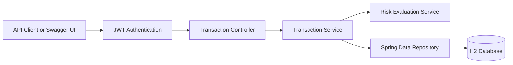

# Transaction Risk API

A production-style Java backend application that accepts financial transactions and generates explainable risk assessments using configurable business rules.

This project demonstrates secure REST API development, Spring Boot architecture, JWT authentication, database persistence, automated testing, OpenAPI documentation, and AI-assisted software engineering practices.

## Live Application

- [Interactive Swagger API](https://transaction-risk-api-production.up.railway.app/swagger-ui/index.html)
- [Application Health Check](https://transaction-risk-api-production.up.railway.app/actuator/health)
- [AI-Assisted Development Workflow](docs/ai-assisted-development.md)

The application is deployed on Railway and exposes interactive OpenAPI documentation for authentication, transaction submission, retrieval, and risk evaluation.

## Key Features

- Java 17 and Spring Boot 3
- Versioned REST APIs
- Transactional outbox with reliable Kafka event publishing
- Transaction search, filtering, sorting, and pagination
- Explainable transaction-risk scoring
- LOW, MEDIUM, and HIGH risk classifications
- Spring Data JPA persistence
- JWT bearer authentication
- Stateless Spring Security
- Request validation
- Swagger UI and OpenAPI documentation
- Spring Boot Actuator health endpoint
- JUnit and Spring integration tests
- Environment-based secret configuration
- Git feature-branch and pull-request workflow

## Architecture



## Risk Evaluation Rules

The current demonstration rules evaluate:

- High transaction amount
- Transaction outside the United States
- Transaction during unusual UTC hours
- Elevated-risk merchant category

Each assessment returns:

- Risk score from 0 to 100
- Risk level
- Human-readable risk reasons

## API Endpoints

| Method | Endpoint | Authentication | Description |
|---|---|---|---|
| POST | `/api/v1/auth/token` | Public | Generate a JWT access token |
| POST | `/api/v1/transactions` | Bearer JWT | Submit and evaluate a transaction |
| GET | `/api/v1/transactions/{id}` | Bearer JWT | Retrieve a transaction assessment |
| GET | `/api/v1/transactions` | Bearer JWT | Search, filter, sort, and paginate transactions |
| GET | `/api/v1/status` | Public | View application status |
| GET | `/actuator/health` | Public | View application health |
| GET | `/swagger-ui.html` | Public | Open interactive API documentation |

## Structured Error Responses

Validation, malformed requests, invalid filters, and missing resources return a consistent response containing:

- Timestamp
- HTTP status
- Error category
- Human-readable message
- Request path
- Field-level validation details when applicable

## Authentication

The demonstration application uses an environment-configured user and a signed JWT.

Set the required variables before running the application:

```bash
export JWT_SECRET="$(openssl rand -base64 32)"
export DEMO_USERNAME="demo"
export DEMO_PASSWORD="DemoPassword123!"
```

Optional configuration:

```bash
export JWT_ISSUER="transaction-risk-api"
export JWT_TTL="PT1H"
```

Real passwords, JWT secrets, customer information, and production credentials must never be committed to GitHub.

## Run the Application

```bash
./mvnw spring-boot:run
```

For local development, open:

```text
http://localhost:8080/swagger-ui.html
```

When using GitHub Codespaces, open the forwarded port URL ending with:

```text
/swagger-ui.html
```

## Generate an Access Token

Request:

```http
POST /api/v1/auth/token
Content-Type: application/json
```

Example request body:

```json
{
  "username": "demo",
  "password": "DemoPassword123!"
}
```

Copy the returned `accessToken` and use it as a bearer token when calling protected endpoints.

## Submit a High-Risk Transaction

```http
POST /api/v1/transactions
Authorization: Bearer <access-token>
Content-Type: application/json
```

Example request:

```json
{
  "customerId": "customer-100",
  "amount": 8000.00,
  "currency": "USD",
  "country": "GB",
  "merchantCategory": "GAMBLING",
  "transactionTime": "2026-07-10T02:30:00Z"
}
```

Example assessment:

```json
{
  "riskScore": 100,
  "riskLevel": "HIGH",
  "riskReasons": [
    "Transaction amount exceeds the configured threshold",
    "Transaction originated outside the United States",
    "Transaction occurred during unusual hours",
    "Merchant category has elevated risk"
  ]
}
```

## Run Tests

```bash
./mvnw test
```

The automated tests cover:

- High-risk evaluation
- Low-risk evaluation
- Valid authentication
- Invalid credentials
- Unauthorized protected requests
- Authorized transaction submission
- Public application-status endpoint

## Security Practices

- Stateless JWT authentication
- JWT expiration and issuer validation
- Environment-based secret management
- Encoded demonstration password
- Request validation
- Protected transaction endpoints
- Restricted Actuator health details
- No committed credentials or confidential production data

## AI-Assisted Development

This project demonstrates practical use of:

- GitHub Copilot
- Cursor
- Claude Code
- ChatGPT

AI tools may assist with implementation scaffolding, repository exploration, design comparison, test-case generation, debugging, and documentation.

Every AI-generated suggestion is manually reviewed, understood, tested, and validated before being accepted.

See the detailed [AI-Assisted Development Workflow](docs/ai-assisted-development.md).

## Technology Stack

- Java 17
- Spring Boot 3.5
- Spring Web
- Spring Data JPA
- Hibernate
- Spring Security
- OAuth2 Resource Server
- JWT
- H2 Database
- Maven
- OpenAPI and Swagger UI
- JUnit
- MockMvc
- GitHub Codespaces

## Development Workflow

This repository follows a professional Git workflow:

1. Create a feature or documentation branch.
2. Implement and test the change.
3. Commit using a meaningful message.
4. Push the branch.
5. Create a pull request.
6. Review and merge into `main`.
7. Delete the completed branch.

## Roadmap

- PostgreSQL production profile
- Docker and Docker Compose
- GitHub Actions CI pipeline
- Kafka transaction events
- Configurable database-backed risk rules
- Testcontainers integration testing
- Public cloud deployment

## Author

**Ramya Reddy Koppula**

- [GitHub](https://github.com/ramya-reddy-k)
- [LinkedIn](https://www.linkedin.com/in/ramyaareddyk)

## Database-configurable Risk Rules

Risk-scoring rules are stored in the database and can be managed through authenticated admin endpoints.

Supported rules:

- High transaction amount
- Foreign-country transactions
- Unusual transaction hours
- High-risk merchant categories

Administrators can enable or disable rules and update their score, parameter, and explanation without changing Java code.

Admin endpoints:

- `GET /api/v1/admin/risk-rules`
- `PUT /api/v1/admin/risk-rules/{code}`
